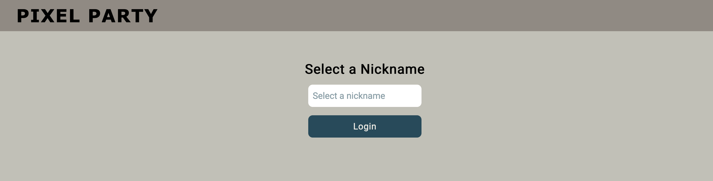
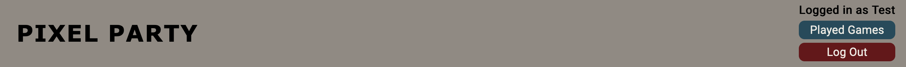
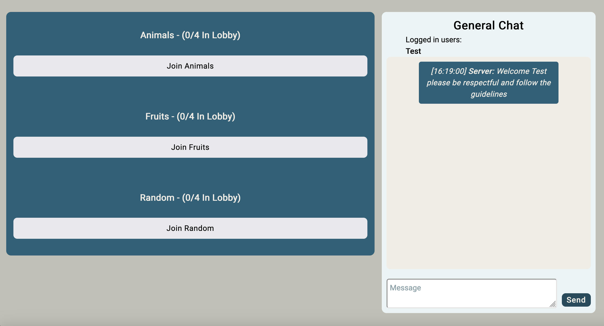
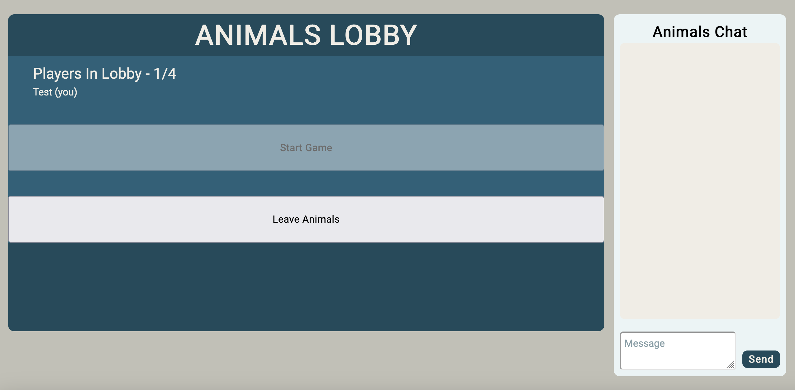
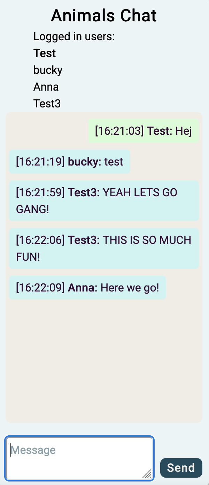
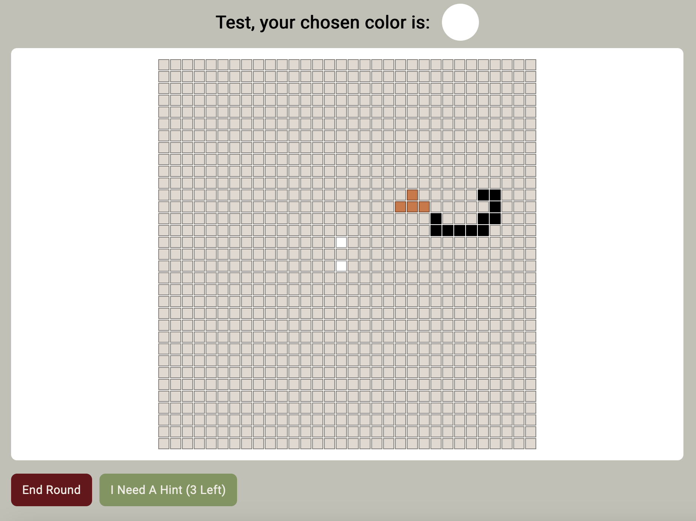
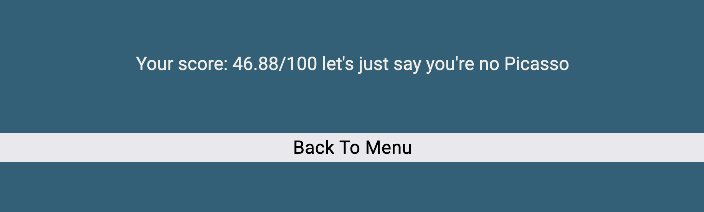
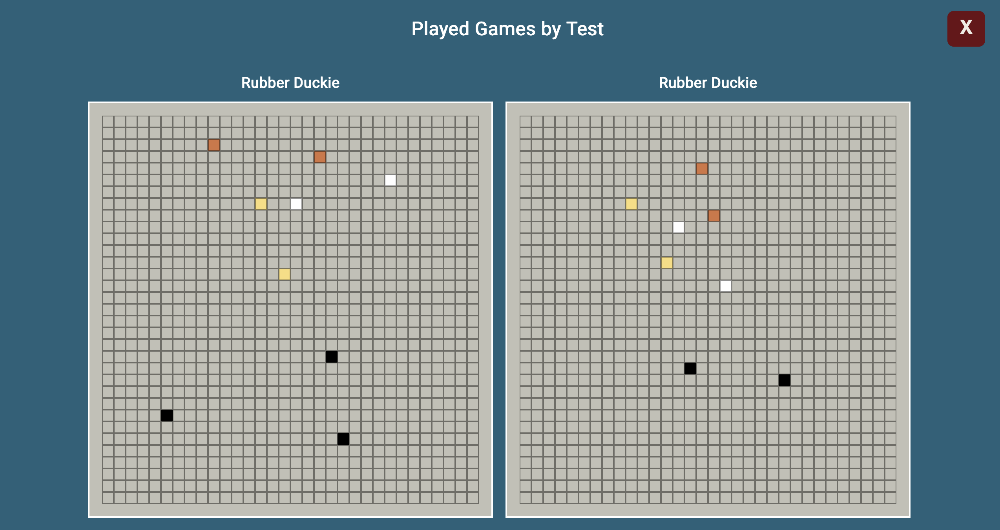

# fed23-gridSock-9-spel
Repo för grupparbete i FED23, API Kurs. Grupp: gridSock 9

#### Deltagare i projektet: 

Simon Stenström
- Github: [@bucky-13](https://github.com/bucky-13)

Anna Karlsen
- Github: [@annkar73](https://github.com/annkar73)  

Johanna Larsson
- Github: [@JohannaPri](https://github.com/JohannaPri)  

Mustafa Mehdi
- Github: [@MustafaaMehdi](https://github.com/MustafaaMehdi)  

## Beskrivning av projektet:

Projektet vi har valt att bygga är ett multiplayer spel med chatt.  
Spelet går ut på att färglägga pixelerade bilder där varje användare automatiskt tilldelas en av de fyra färger som ingår i den aktuella bilden. Bilden/spelplanen slumpas från en databas, där det finns 5 olika bilder/spelplaner som kan genereras till sidan.  

## Hur man startar repot:
En gång när man laddar ner repot lokalt: gå in på cd server och kör npm install, gör samma på client 

Lägg in en .env i server mappen som innehåller:  
Ang nycklar till .env får ni fråga om dom till oss.

Starta servern genom att köra ‘nodemon start’ (eller 'nodemon run’) i terminalen i servermappen. 

Starta klienten genom att köra ‘npm run dev’ i terminalen i clientmappen. 

Vill man köra server lokalt får man ändra alla https://game-99blu.ondigitalocean.app till http://localhost:3001 i client eller vilken port man vill använda. Man får söka efter var ondigitalocean-länken finns 

Vill man köra egen databas (bör vara en SQL) så ändra bara värdena i .env till ens egna databas. Man kommer dock få lägga in egna spelplaner då. 

## Tech Stack:

## Screenshots:

##### LogIn page

##### Header

##### Main Lobby

##### GameRoom Lobby

##### GameRoom Chat

##### Start Game Button

##### Leave Room Button

##### Game in Progress

##### Score

##### Played Games
